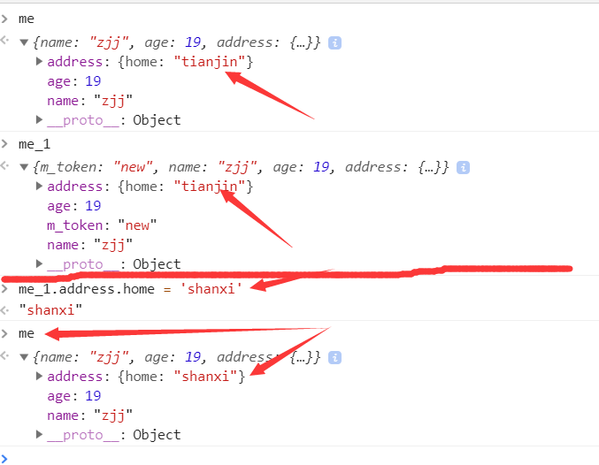
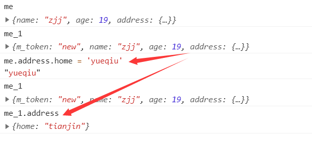

## 常用字符串方法
| 方法 | 定义 | 示例 |
| :----| :---- | :---- |
| indexOf() | 方法返回字符串中指定文本首次出现的索引,没找到返回-1 | str.indexOf("China") |
| slice() | 提取字符串的某个部分并在新字符串中返回被提取的部分 | str.slice(起始索引,终止索引) |
| substr() | 类似于 slice(),不同之处在于第二个参数规定被提取部分的长度 | str.substr(起始索引,长度) |
| replace() | 方法用另一个值替换在字符串中指定的值 | str.replace("Microsoft", "W3School") |
| toUpperCase() | 把字符串转换为大写 | str.toUpperCase() |
| toLowerCase() |  把字符串转换为小写 | str.toLowerCase() |
| trim() | 方法删除字符串两端的空白符 | alert(str.trim()) |
| split() | 将字符串转换为数组 | str.split(",") |

### 您还可以使用上面的 replace 方案把 trim 函数添加到 JavaScript String.prototype
```js
if (!String.prototype.trim) {
  String.prototype.trim = function () {
    return this.replace(/^[\s\uFEFF\xA0]+|[\s\uFEFF\xA0]+$/g, '');
};
var str = "       Hello World!        ";
alert(str.trim());
```


## 常用数组方法
| 方法 | 定义 | 示例 |
| :----| :---- | :---- |
| toString() | 把数组转换为数组值（逗号分隔）的字符串 | 数组.toString() |
| join() | 它的行为类似 toString()，但是您还可以规定分隔符 | 数组.join(" * ") |
| pop() | 方法从数组中删除最后一个元素 | 数组.pop() |
| push() | 方法（在数组结尾处）向数组添加一个新的元素 | 数组.push("Kiwi") |
| shift() | 方法会删除首个数组元素 | 数组.shift() |
| unshift() | 方法（在开头）向数组添加新元素 | 数组.unshift("Lemon") |
| concat() | 方法通过合并（连接）现有数组来创建一个新数组 | 新数组 = 数组1.concat(数组2) |
| findIndex() | 传入一个回调函数，找到数组中符合当前搜索规则的第一个元素，返回它的下标，终止搜索 | arr.findIndex(n => typeof n === "number") |


## 数组去重
```js
<script>
    function fn(arr) {
        let arrNew = [];
        for (let i = 0; i < arr.length; i++) {
            if (arrNew.indexOf(arr[i]) == -1) {
                arrNew.push(arr[i]);
            }
        }
        console.log(arrNew); //0,1,2
    }
    fn([0, 1, 2, 1, 2])
</script>
```
```js
function newArr(arr) {
        return Array.from(new Set(arr))
    }
    var arr = [0, 1, 2, 0, 1];
	console.log(newArr(arr)) // 0,1,2
```


<!-- ## 常用对象方法
| 方法 | 定义 | 示例 |
| :----| :---- | :---- |
| 单元格 | 单元格 | 单元格 |
| 单元格 | 单元格 | 单元格 | -->

## 深浅拷贝
>`浅拷贝`只复制指向某个对象的指针而不复制对象本身，新旧对象还是共享同一块内存。
```js
  var me = {
      name: 'zjj',
      age: 19,
      address: {
          home: 'tianjin'
      }
  };
  
  var me_1 = {
      m_token: 'new'
  };
  
  function extend(p, c){
      var c = c || {};
      for(var i in p) {
          c[i] = p[i];
      }
  }
  extend(me,me_1);
  ```
>


>`深拷贝`会另外创造一个一模一样的对象，新对象跟原对象不共享内存，修改新对象不会改到原对象。
```js
let arr = [1, 3, {
    username: ' kobe'
}];

let aarrNewr4 = JSON.parse(JSON.stringify(arr));
arrNew[2].username = 'duncan';
console.log(arr, arrNew) //arr = [1, 3, kobe]; arrNew = [1, 3, duncan]
// 用JSON.stringify将对象转成JSON字符串，再用JSON.parse()把字符串解析成对象，一去一来，新的对象产生了，而且对象会开辟新的栈，实现深拷贝
// 这种方法虽然可以实现数组或对象深拷贝,但不能处理函数
```

### 第二种深拷贝方法
```js
  var me = {
      name: 'zjj',
      age: 19,
      address: {
          home: 'tianjin'
      }
  };
  
  var me_1 = {
      m_token: 'new'
  };
  
  function extend(p, c){
      var c = c || {};
      
      for(var i in p) {
          c[i] = p[i];
      }
  }

  function extendDeeply(p, c) {
    var c = c || {};
      
      for(var i in p) {
        if(typeof p[i] === 'object') {
          // 引用类型需要递归实现深拷贝
          c[i] = (p[i].constructor === Array ) ? [] : {}
          extendDeeply(p[i], c[i]);
        } else {
          // 非引用类型直接复制即可
          c[i] = p[i];
        } 
      }
  }
  extendDeeply(me,me_1);
  ```
  >
