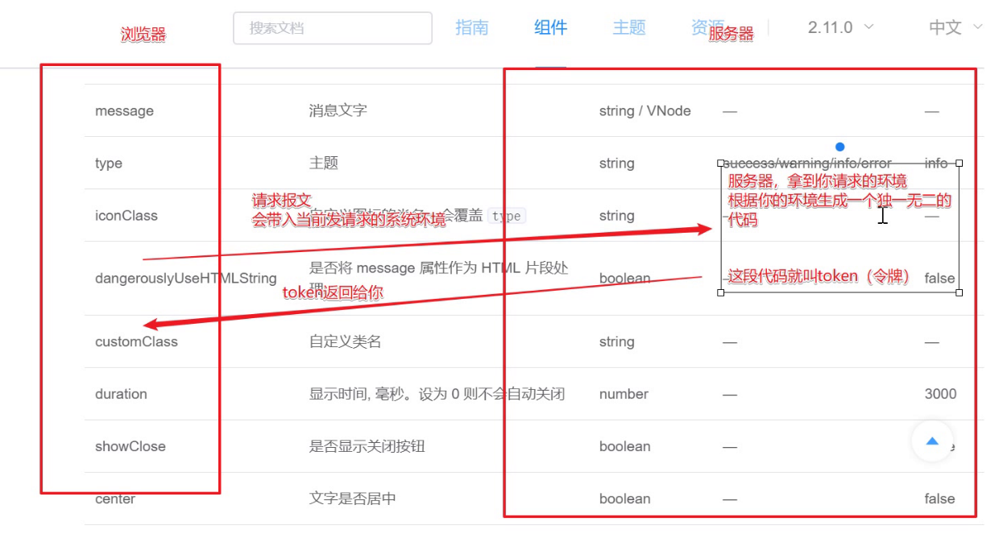

## token令牌
> 图释 
### 

## axios请求拦截
> 发请求前,拦截下来加一个请求头token 
```js
//请求拦截
http.interceptors.request.use(function (config) {

    // 每次请求之前把是否响应弹出一次的标记改为false
    flag = false;

    // 发送请求前调用（发送请求做一些事）
    // 把你所有的请求拦下来
    // 拦下来给你加一个请求头，请求头的内容是token
    config.headers.Authorization = window.localStorage.getItem('token')
    // window.console.log('我调用了', config)
    return config;

}, function (error) {

    //发生错误的回调函数
    return Promise.reject(error);
});
```


## 从浏览器地址栏输入url到显示页面的步骤
1. 浏览器（客户端）进行了地址解析。
2. 将解析出的域名进行dns解析。
3. 通过ip寻址和arp，找到目标（服务器）地址。
4. 进行tcp三次握手，建立tcp连接。
5. 浏览器发送数据，等待服务器响应。
6. 服务器处理请求，并对请求做出响应。
7. 浏览器收到服务器响应，得到html代码。
8. 渲染页面。


